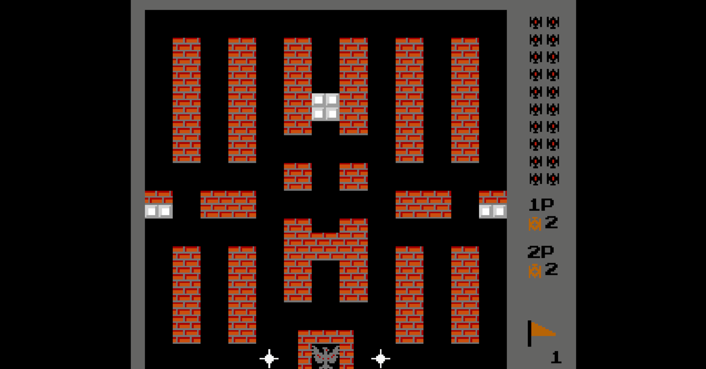
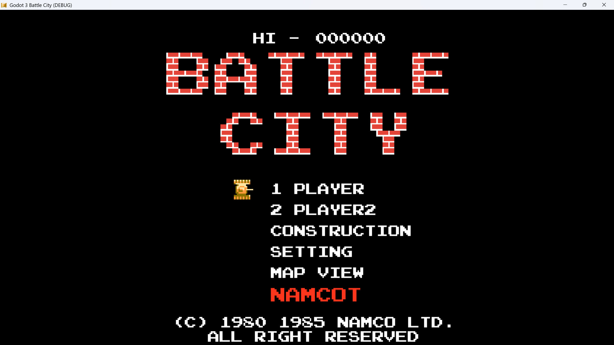
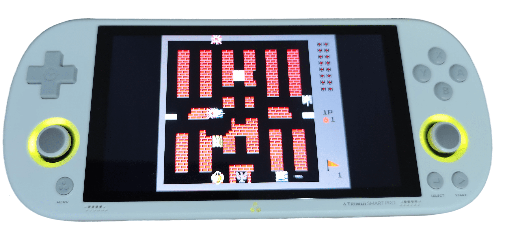

# Battle City Clone

## 项目简介 / Project Introduction

这是一个基于 Godot 引擎的经典坦克大战游戏克隆，包含 Godot 3 和 Godot 4 两个版本。

This is a classic Battle City game clone based on the Godot engine, including both Godot 3 and Godot 4 versions.

## 游戏控制 / Game Controls

### 玩家 1 / Player 1:
- 方向键 / Arrow keys: 移动 / Move
- J: 开火 / Fire

### 玩家 2 / Player 2:
- WSAD: 移动 / Move
- 小键盘 3 / Keypad 3: 开火 / Fire

### 通用控制 / Common Controls:
- ENTER: 选择 / Select

## 项目结构 / Project Structure

### Godot 3 版本 / Godot 3 Version (`godot3BattleCity/`)

#### 主要目录 / Main Directories:
- `addons/`: 插件目录，包含输入绑定插件
- `autoload/`: 自动加载脚本，包含游戏全局管理
- `font/`: 字体文件
- `level/`: 关卡文件 (JSON 格式)
- `scene/`: 游戏场景文件 (.tscn)
- `script/`: 游戏脚本文件 (.gd)
- `shader/`: 着色器文件
- `sound/`: 音效文件
- `sprite/`: 精灵图像文件
- `theme/`: UI 主题文件
- `video/`: 视频文件

### Godot 4 版本 / Godot 4 Version (`godot4BattleCity/`)

#### 主要目录 / Main Directories:
- `addons/`: 插件目录，包含输入绑定插件
- `autoload/`: 自动加载脚本
- `font/`: 字体文件
- `level/`: 关卡文件 (JSON 格式)
- `scene/`: 游戏场景文件 (.tscn)

## 核心文件说明 / Core Files Description

### 场景文件 / Scene Files:
- `game.tscn`: 主游戏场景
- `player.tscn`: 玩家坦克场景
- `enemy.tscn`: 敌人坦克场景
- `map.tscn`: 地图场景
- `base.tscn`: 基地场景

### 脚本文件 / Script Files:
- `gameScene.gd`: 游戏主逻辑
- `player.gd`: 玩家控制逻辑
- `enemy.gd`: 敌人 AI 逻辑
- `map.gd`: 地图加载和管理
- `tank.gd`: 坦克基类

## 技术特点 / Technical Features

1. **双版本支持**: 同时支持 Godot 3 和 Godot 4
2. **多玩家模式**: 支持双人本地游戏
3. **关卡系统**: 包含多个预定义关卡
4. **音效系统**: 完整的游戏音效
5. **视觉效果**: 包含坦克爆炸、子弹特效等
6. **输入系统**: 可自定义的输入绑定

## 开发计划 / Development Plan

- [ ] 地图编辑器 (Map editor)
- [ ] 地图查看 (Map viewing)
- [ ] Godot 4 版本完整支持 (Godot 4 version support)
- [ ] 多人联机 (Multiplayer)

## 导出说明 / Export Instructions

导出游戏时，需要将地图文件（JSON 文件）一起导出。

When exporting the game, make sure to include the map files (JSON files).

## 屏幕截图 / Screenshots

## 游戏链接 / Game Link

- itch.io: https://absolve.itch.io/battle-city-remake

## 许可证 / License

MIT License
